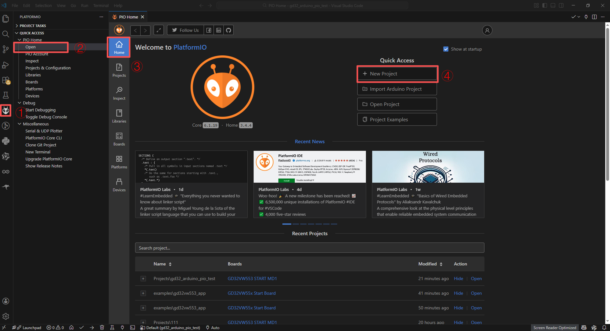
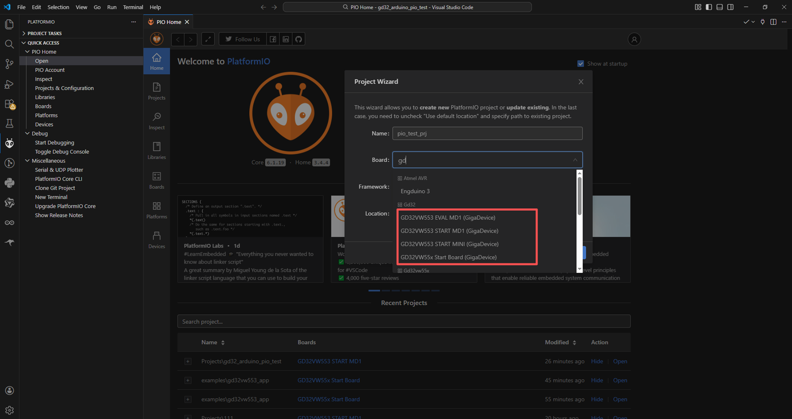
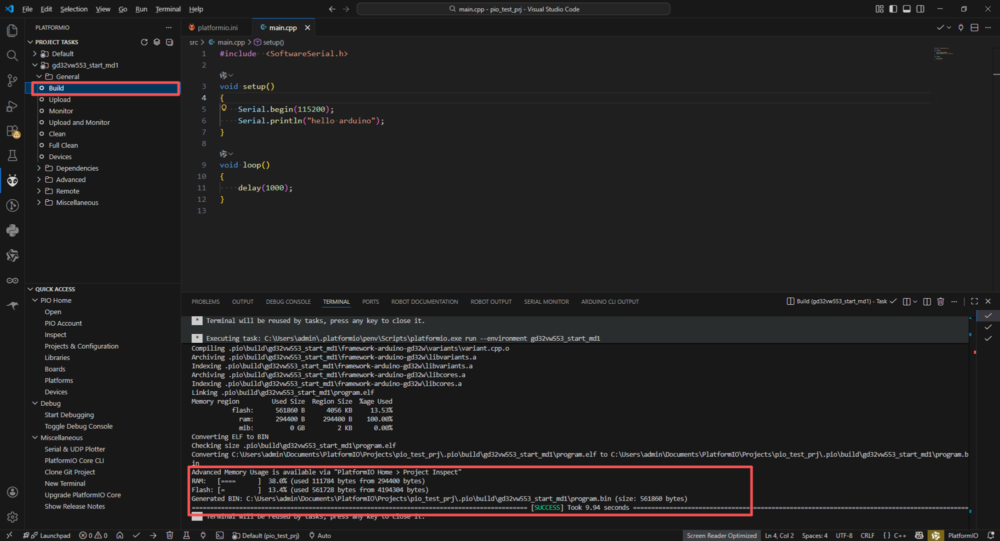
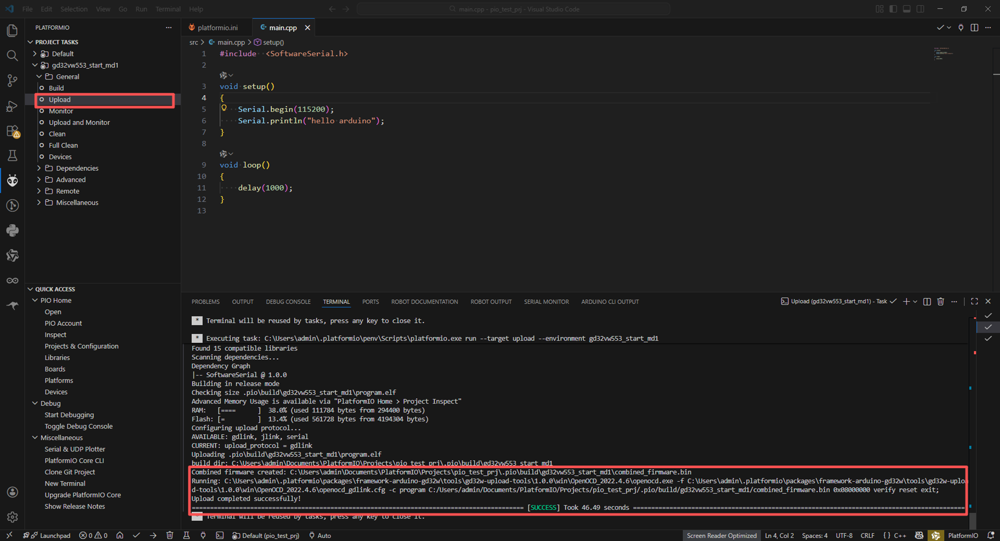

# GD32 Arduino PlatformIO User Guide

This guide explains how to use PlatformIO in VSCode for GD32 Arduino project development.

## Prerequisites

- VSCode installed
- PlatformIO extension installed

## Installation Steps

### 1. Clone Platform Files

Clone the [platform-arduino-gd32](https://github.com/tqlblzj/platform-arduino-gd32) repository to the PlatformIO platforms directory:

```bash
# PlatformIO default installation path is C:\Users\<username>\.platformio
# Clone platform files to the following directory:
git clone https://github.com/tqlblzj/platform-arduino-gd32.git C:\Users\<username>\.platformio\platforms\platform-gd32-arduino
```

After cloning, the `platform-gd32-arduino` directory structure is as follows:

```
platform-gd32-arduino/
├── platform.json              # Platform definition file
├── readme.md                  # This documentation
├── boards/                    # Board configuration files
│   ├── gd32vw553_eval_md1.json
│   ├── gd32vw553_start_md1.json
│   └── gd32vw553_start_mini.json
├── builder/                   # Build scripts
│   ├── main.py
│   └── frameworks/
│       ├── _bare.py
│       └── arduino.py
├── scripts/                   # Utility scripts
│   └── download_framework.py
└── images/                    # Documentation images
```

### 2. Download Framework Files

Run the `download_framework.py` script in the `scripts` directory. This script will automatically download and install GD32 Arduino-related framework files to the `C:\Users\<username>\.platformio\packages` directory:

```bash
python scripts/download_framework.py
```

## Creating a Project

After completing the installation steps, you can create a PlatformIO project:

1. Click the PlatformIO icon on the left sidebar of VSCode to enter the Home interface
2. Click the **New Project** button
3. In the configuration dialog:
   - Enter a project name
   - Select the board type (you can quickly locate it by typing "gd32")
   - Select the framework as "Arduino"
   - Click **Finish** to complete the creation





## Testing the Toolchain

To verify that the toolchain is configured correctly, replace the content in `src/main.cpp` with the following test code:

```cpp
#include <Arduino.h>

void setup()
{
    Serial.begin(115200);
    Serial.println("hello arduino");
}

void loop()
{
    delay(1000);
}
```

## Building and Uploading

1. **Build Project**: Click **Project Tasks** → **Build** in the PlatformIO bottom bar
2. **Upload Firmware**: After successful compilation, click **Upload**
3. **View Output**: After firmware is successfully flashed, open the serial monitor (baud rate set to 115200) to see the "hello arduino" output




